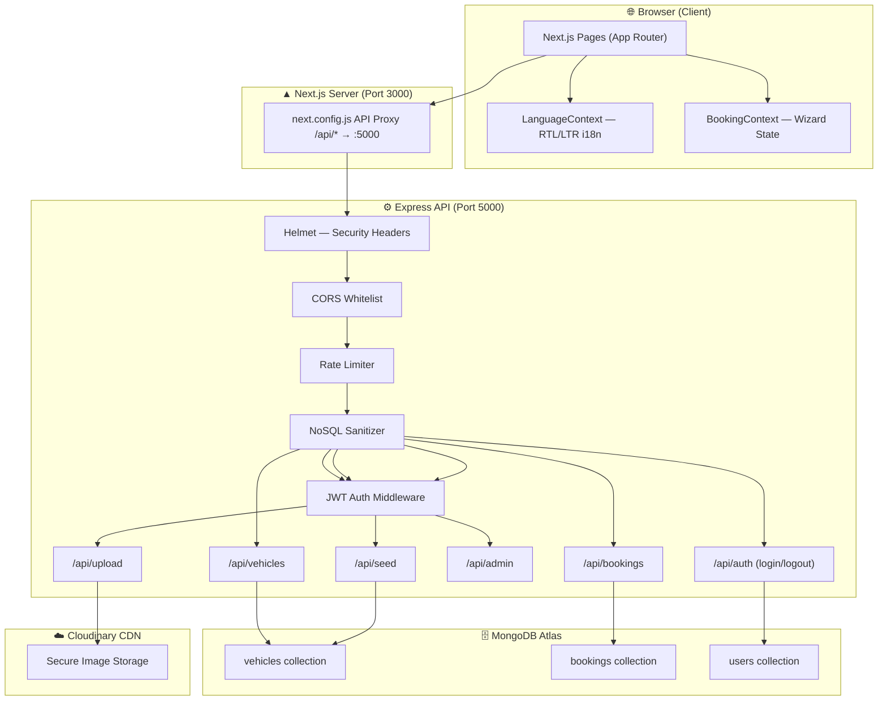

# LuxeRent — Complete Project Documentation & Architecture Guide

> **LuxeRent** is a state-of-the-art, premium vehicle rental platform built specifically for the Algerian market. It provides a luxurious reservation experience for sports cars, premium motorcycles, jet skis, and popular local vehicles — with a fully localized experience in Arabic, French, and English.

---

## 📌 Table of Contents

1. [Project Overview & Goals](#1-project-overview--goals)
2. [Tech Stack](#2-tech-stack)
3. [System Architecture](#3-system-architecture)
4. [Directory Structure](#4-directory-structure)
5. [Backend — Express API](#5-backend--express-api)
   - [Security Middleware Stack](#security-middleware-stack)
   - [API Routes Reference](#api-routes-reference)
   - [Database Models](#database-models)
6. [Frontend — Next.js App](#6-frontend--nextjs-app)
   - [Pages & Routing](#pages--routing)
   - [Global State (Contexts)](#global-state-contexts)
   - [Booking Flow (User Journey)](#booking-flow-user-journey)
7. [Admin Dashboard](#7-admin-dashboard)
   - [Role-Based Access Control (RBAC)](#role-based-access-control-rbac)
8. [Localization & RTL Engine](#8-localization--rtl-engine)
9. [Media & CDN](#9-media--cdn)
10. [Environment Variables](#10-environment-variables)
11. [Local Development Setup](#11-local-development-setup)
12. [Key Security Implementations](#12-key-security-implementations)

---

## 1. Project Overview & Goals

LuxeRent enables customers to:
- **Browse** an entire fleet of Cars, Motorcycles, and JetSkis
- **Reserve instantly** by selecting a vehicle, choosing dates/times and a pickup location (with all major Algerian airports included), and submitting a simple contact form
- **Pay on-site** — no credit card or upfront deposit is ever required
- **Experience** a seamless, premium interface in French (with 100% Algerian location & currency localization)

Key business characteristics:
| Property | Value |
|---|---|
| Currency | Algerian Dinar (DA) |
| Primary Language | French (`fr`) |
| Payment Model | 100% pay on pickup — zero charges online |
| Pickup Hubs | Algerian airports + city agencies + marine bases |
| Vehicle Categories | Cars, Motorcycles, JetSkis |
| Pricing Unit | Per-day (Cars/Motorcycles) or Per-hour (JetSkis) |

---

## 2. Tech Stack

| Layer | Technology |
|---|---|
| **Frontend** | Next.js 16.2+ (App Router, TypeScript) |
| **Backend** | Node.js + Express.js (ES Modules) |
| **Database** | MongoDB (via Mongoose ODM) |
| **Media CDN** | Cloudinary (image uploads + secure URLs) |
| **Styling** | Vanilla CSS + Tailwind CSS utility classes |
| **Auth** | JWT tokens (bcrypt password hashing) |
| **Security** | Helmet, express-rate-limit, express-mongo-sanitize, CORS whitelist |
| **Dev Runtime** | `node --watch` (backend), `next dev` (frontend) |

---

## 3. System Architecture

LuxeRent is structured as a **decoupled monorepo** — the Next.js frontend and Express backend run as two separate processes and communicate over HTTP via a reverse proxy (`/api/*` rewrites in `next.config.js`).



---

## 4. Directory Structure

```text
Rental Agency/
├── PROJECT_GUIDE.md              ← This file
│
├── backend/                      ← Express.js REST API
│   ├── config/
│   │   ├── db.js                 ← Mongoose connection
│   │   └── cloudinary.js         ← Multer-Cloudinary storage adapter
│   ├── middleware/
│   │   └── auth.js               ← JWT verification middleware
│   ├── models/
│   │   ├── Vehicle.js            ← Vehicle schema (fleet catalog)
│   │   ├── Booking.js            ← Booking/reservation schema
│   │   └── User.js               ← Admin/Agent user schema
│   ├── routes/
│   │   ├── vehicles.js           ← GET/POST/PUT/DELETE fleet routes
│   │   ├── bookings.js           ← POST booking, GET list, PATCH status
│   │   ├── auth.js               ← POST /login, POST /logout
│   │   ├── admin.js              ← Protected admin stats endpoint
│   │   ├── upload.js             ← Cloudinary image upload
│   │   └── seed.js               ← Database reset & seeding
│   ├── scripts/
│   │   └── generate-admin-hash.js ← Utility: generate bcrypt password hash
│   ├── seed-cloudinary.js        ← Batch Cloudinary asset migrator
│   ├── index.js                  ← Server entrypoint & middleware stack
│   ├── .env                      ← Environment secrets (never commit!)
│   └── package.json
│
└── frontend/                     ← Next.js 16 App Router SPA
    ├── src/
    │   ├── app/                  ← All pages (Next.js App Router)
    │   │   ├── page.tsx          ← Home page (hero + search + fleet grid)
    │   │   ├── layout.tsx        ← Root layout (fonts, providers, header)
    │   │   ├── globals.css       ← Global styles & Tailwind base
    │   │   ├── about/
    │   │   │   └── page.tsx      ← About Us + agency locations + contact form
    │   │   ├── fleet/
    │   │   │   ├── page.tsx      ← Fleet catalog with filters sidebar
    │   │   │   └── [id]/
    │   │   │       └── page.tsx  ← Vehicle detail + booking form + gallery
    │   │   ├── checkout/
    │   │   │   └── [vehicleId]/
    │   │   │       └── page.tsx  ← 4-step checkout wizard
    │   │   └── admin/
    │   │       └── page.tsx      ← Admin/Agent dashboard
    │   ├── components/
    │   │   ├── ui/               ← Reusable primitives (Button, Input, Select…)
    │   │   └── Header.tsx        ← Sticky navbar with language switcher
    │   ├── context/
    │   │   ├── BookingContext.tsx ← Global booking state (wizard step, data)
    │   │   ├── LanguageContext.tsx ← i18n translations + RTL engine
    │   │   └── AuthContext.tsx    ← Admin/Agent JWT auth state
    │   └── lib/
    │       └── utils.ts          ← Shared utilities (className merging, etc.)
    ├── next.config.js            ← API proxy rewrites (/api/* → :5000)
    ├── tailwind.config.ts        ← Design token configuration
    └── package.json
```

---

## 5. Backend — Express API

### Security Middleware Stack

The backend runs the following middleware in order on every request (`backend/index.js`):

| Order | Middleware | Purpose |
|---|---|---|
| 1 | `helmet()` | Sets security headers: `X-Frame-Options`, `X-Content-Type-Options`, `Strict-Transport-Security`, tight CSP (allows only `self` + Cloudinary images) |
| 2 | `cors()` | Strict origin whitelist — only the `FRONTEND_URL` env variable is allowed. All other browser origins are rejected with a CORS error |
| 3 | `express-rate-limit` | Global: 200 req/15 min window. Stricter: 10 req/15 min on `POST /api/bookings` to prevent spam |
| 4 | `express-mongo-sanitize` | Strips `$` and `.` characters from `req.body`, `req.query`, and `req.params` to prevent NoSQL injection |
| 5 | `express.json({ limit: '10mb' })` | JSON body parser with capped payload size |

### API Routes Reference

#### Public Routes (no authentication required)

| Method | Endpoint | Description |
|---|---|---|
| `GET` | `/api/vehicles` | List all vehicles. Supports `?category=Car\|Motorcycle\|JetSki` query filter |
| `GET` | `/api/vehicles/:id` | Fetch a single vehicle by MongoDB ObjectId |
| `POST` | `/api/bookings` | Create a new booking reservation |
| `POST` | `/api/auth/login` | Login with username + password → returns JWT token |

#### Protected Routes (requires `Authorization: Bearer <token>` header)

| Method | Endpoint | Who | Description |
|---|---|---|---|
| `GET` | `/api/admin` | Admin + Agent | Dashboard stats (total bookings, clients, pending) |
| `GET` | `/api/bookings` | Admin only | Full booking list with guest contact details |
| `PATCH` | `/api/bookings/:id/status` | Admin + Agent | Update booking status |
| `POST` | `/api/vehicles` | Admin only | Create a new vehicle |
| `PUT` | `/api/vehicles/:id` | Admin only | Update vehicle data + images |
| `DELETE` | `/api/vehicles/:id` | Admin only | Remove vehicle from fleet |
| `POST` | `/api/upload` | Admin only | Upload images to Cloudinary |
| `POST` | `/api/seed` | Admin only | Wipe and re-seed database |

### Database Models

#### `Vehicle.js`

```javascript
{
  make: String,              // e.g. "BMW"
  model: String,             // e.g. "M3 Competition"
  year: Number,              // e.g. 2024
  pricePerDay: Number,       // Cars and Motorcycles (daily rate in DA)
  pricePerHour: Number,      // JetSkis (hourly rate in DA)
  category: 'Car' | 'Motorcycle' | 'JetSki',
  status: 'Available' | 'Rented' | 'Maintenance',
  images: [String],          // Array of Cloudinary secure URLs
  description: String,       // Rich text description (admin-editable)
  requirements: String,      // Rental requirements (line-separated)
  conditions: String,        // Terms and conditions (line-separated)
  landingImage: String,      // Optional hero image for the detail page
  unavailabilityDates: [{    // Blocked date ranges (admin-managed)
    start: Date,
    end: Date
  }],
  features: {
    transmission: 'Manual' | 'Automatic',
    fuel: 'Petrol' | 'Diesel' | 'Electric' | 'Hybrid',
    doors: Number,           // Cars
    cc: Number,              // Motorcycles (engine displacement)
    horsepower: Number,      // JetSkis
    helmet_included: Boolean,
    life_jackets_included: Boolean
  }
}
```

#### `Booking.js`

```javascript
{
  vehicleId: ObjectId,       // Reference to Vehicle document
  guestName: String,
  guestEmail: String,
  guestPhone: String,
  pickupDate: Date,
  returnDate: Date,
  pickupLocation: String,    // e.g. "Aéroport d'Alger - Houari Boumédiène"
  addOns: [String],          // ['GPS', 'Helmet', 'GoPro']
  totalPrice: Number,        // Calculated total in DA
  paymentStatus: 'Pay On-Site',    // Always on-site — never online
  bookingStatus: 'Pending' | 'Confirmed' | 'Completed' | 'Cancelled'
}
```

#### `User.js`

```javascript
{
  username: String,          // Unique login identifier
  passwordHash: String,      // bcrypt hash (min 12 rounds)
  role: 'Admin' | 'Agent'   // Controls dashboard permissions
}
```

---

## 6. Frontend — Next.js App

### Pages & Routing

| Route | File | Description |
|---|---|---|
| `/` | `app/page.tsx` | Hero banner with animated background, search widget (location + dates), category showcase, and full vehicle grid. Clicking any vehicle card navigates to its detail page. |
| `/fleet` | `app/fleet/page.tsx` | Full fleet catalog with a left-side filters sidebar (price range slider, transmission checkboxes, fuel type checkboxes). All vehicle cards are clickable. |
| `/fleet/[id]` | `app/fleet/[id]/page.tsx` | Vehicle detail page: photo gallery, full specs grid, description/requirements/conditions sections, and the **inline booking form** (location dropdown + date + time pickers with quick presets). |
| `/checkout/[vehicleId]` | `app/checkout/[vehicleId]/page.tsx` | 4-step checkout wizard: Summary → Add-ons → Contact Details → Confirmation. Includes a sticky dark "receipt" pricing card on the right. |
| `/about` | `app/about/page.tsx` | Agency locations (map links, phone, hours), contact form, and team section. |
| `/admin` | `app/admin/page.tsx` | Protected dashboard for Admin and Agent roles. |

### Global State (Contexts)

#### `BookingContext.tsx`
Holds all reservation data across the multi-step wizard. Persists through page navigation using React Context.

```typescript
interface BookingData {
  vehicleId: string;
  pickupDate: string;       // ISO string
  returnDate: string;       // ISO string
  pickupLocation: string;
  addOns: string[];         // ['GPS', 'Helmet', 'GoPro']
  guestName: string;
  guestEmail: string;
  guestPhone: string;
}
```

#### `LanguageContext.tsx`
Provides the `t(key)` translation function and `locale` (`'en' | 'fr' | 'ar'`) across all components. On Arabic selection, it programmatically sets `document.documentElement.dir = 'rtl'` to flip the entire layout.

#### `AuthContext.tsx`
Stores the JWT token and decoded user role after login. Used by the admin dashboard to conditionally render Agent-restricted sections. Agents **cannot** see guest contact data (names, emails, phones).

### Booking Flow (User Journey)

```
Home Page
  │
  ├── [Search Widget] → selects location + dates → navigates to /fleet
  │
  └── [Vehicle Card Click] ──────────────────────────────────┐
                                                              ↓
Fleet Page                                         Vehicle Detail Page (/fleet/[id])
  │                                                  ├── Photo gallery (multi-image)
  └── [Vehicle Card Click] ──────────────────────► ├── Specs, description, requirements
                                                    ├── Conditions section
                                                    ├── Quick date presets (Today / Tomorrow / This Weekend)
                                                    ├── Location dropdown (Algerian airports + agencies)
                                                    ├── Pickup date + time selectors (split inputs)
                                                    └── [Reserve Now] → /checkout/[vehicleId]
                                                                              │
                                                              ┌───────────────┘
                                                              ↓
                                                    Checkout Wizard
                                                    ├── Step 1: Booking Summary (dates, vehicle, location)
                                                    ├── Step 2: Add-ons (GPS / Helmet / GoPro)
                                                    ├── Step 3: Contact Details (name, email, phone)
                                                    └── Step 4: Confirmation ✅
```

**Pickup Locations Available:**
- `Aéroport d'Alger - Houari Boumédiène`
- `Aéroport d'Oran - Ahmed Ben Bella`
- `Aéroport de Constantine - Mohamed Boudiaf`
- `Agence Centrale (Alger Centre)`
- `Agence Oran (Centre Ville)`
- *(For JetSkis only):* `Sidi Fredj Marina (Alger)`, `Les Andalouses Beach (Oran)`

**Date Quick Presets (on Vehicle Detail page):**
| Preset | Pickup | Return |
|---|---|---|
| Today | Current time | +24h |
| Tomorrow | Tomorrow 10:00 | +24h |
| This Weekend | Next Friday 15:00 | Sunday 18:00 |

---

## 7. Admin Dashboard

Access at: `http://localhost:3000/admin`

The dashboard is protected by JWT authentication. A user must log in with valid `username` + `password` credentials (stored in MongoDB, hashed with bcrypt).

### Role-Based Access Control (RBAC)

| Feature | Admin | Agent |
|---|---|---|
| View dashboard stats (bookings, clients, pending) | ✅ | ✅ |
| Update booking statuses | ✅ | ✅ |
| Add / Edit / Delete vehicles | ✅ | ❌ |
| Upload vehicle images | ✅ | ❌ |
| View guest contact details (name, email, phone) | ✅ | ❌ |
| Re-seed the database | ✅ | ❌ |

**Creating an admin user:**
```bash
cd backend
node scripts/generate-admin-hash.js
# Follow the prompts to generate a bcrypt hash, then insert the user into MongoDB manually
```

**Vehicle Management Features (Admin only):**
- Full CRUD (create, edit, delete vehicles)
- Rich description editor with multi-line requirements & conditions
- Photo gallery management (Cloudinary upload with instant previews)
- Optional "landing image" for the vehicle detail hero section
- Blocked dates management — set ranges when a vehicle is unavailable (shown on the booking calendar to customers)

---

## 8. Localization & Currency Engine

LuxeRent operates primarily in **French (`fr`)** with native Algerian Dinar formatting managed by `LanguageContext.tsx`:

| Parameter | Value | Details |
|---|---|---|
| Primary Language | French (`fr`) | Default locale for all public & admin pages |
| Layout Direction | `ltr` | Standard Left-To-Right UI alignment |
| Currency Display | `DA` | Algerian Dinar formatted via `toLocaleString('fr-DZ')` (e.g. `18 000 DA`) |

All central UI strings are organized inside the `translations` object inside `LanguageContext.tsx` and accessible via `t(key, fallback)`.

---

## 9. Media & CDN

All vehicle images are hosted on **Cloudinary**. The flow:

1. Admin uploads image(s) through the dashboard
2. Backend receives via `multer-storage-cloudinary`
3. Cloudinary stores and returns a secure HTTPS URL
4. URL is saved in the `images[]` array on the Vehicle document
5. Frontend fetches and renders directly from Cloudinary CDN

**Batch seeding with Cloudinary migration:**
```bash
cd backend
node seed-cloudinary.js
# Wipes existing vehicles, uploads all local seed images to Cloudinary,
# and inserts new vehicle documents with fresh Cloudinary URLs
```

The Content Security Policy in `helmet()` is configured to allow `img-src` from `https://res.cloudinary.com`.

---

## 10. Environment Variables

### `backend/.env`

```env
PORT=5000
MONGODB_URI=mongodb+srv://<user>:<pass>@cluster.mongodb.net/luxerent
CLOUDINARY_CLOUD_NAME=your_cloud_name
CLOUDINARY_API_KEY=your_api_key
CLOUDINARY_API_SECRET=your_api_secret
JWT_SECRET=your_super_secret_jwt_key_min_32_chars
FRONTEND_URL=http://localhost:3000
```

> ⚠️ **Never commit `.env` to version control.** It is already listed in `.gitignore`.

---

## 11. Local Development Setup

### Prerequisites
- Node.js 18+
- MongoDB Atlas account (or local MongoDB)
- Cloudinary account

### Starting the servers

```bash
# Terminal 1 — Backend API
cd backend
npm install
npm run dev        # Starts on http://localhost:5000 with --watch hot reload

# Terminal 2 — Frontend
cd frontend
npm install
npm run dev        # Starts on http://localhost:3000 (or 3001 if port taken)
```

The frontend's `next.config.js` automatically proxies all `/api/*` requests to `http://localhost:5000`, so no CORS issues arise in development.

### Clearing the Turbopack cache (if runtime errors appear)

```bash
# Stop the frontend dev server, then:
cd frontend
Remove-Item -Recurse -Force .next
npm run dev
```

---

## 12. Key Security Implementations

| Vulnerability | Implementation |
|---|---|
| **NoSQL Injection** | `express-mongo-sanitize` strips `$` and `.` operators from all incoming request data |
| **XSS / Clickjacking** | `helmet()` sets `X-Frame-Options: DENY`, `X-Content-Type-Options: nosniff`, and a strict Content-Security-Policy |
| **CORS Leaks** | Strict origin whitelist — only `FRONTEND_URL` is accepted; all other browser origins are blocked |
| **Brute Force** | `express-rate-limit` — 200 req/15min globally, 10 req/15min on the booking endpoint |
| **Plaintext Passwords** | Admin passwords are hashed with `bcrypt` (min 12 rounds) before storage |
| **Auth Token Forgery** | JWT tokens are signed with `JWT_SECRET` and verified on every protected route via `middleware/auth.js` |
| **Privilege Escalation** | Role check in `middleware/auth.js` — `Admin`-only routes explicitly reject `Agent` tokens with HTTP 403 |
| **Large Payload Attacks** | `express.json({ limit: '10mb' })` caps request body size |
